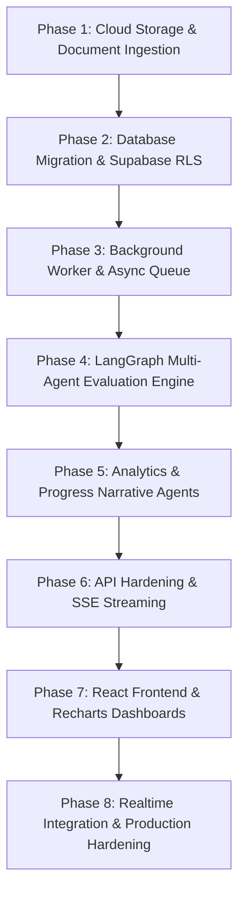

# VIDYARANYA — Phase-wise Development Plan & Architecture Roadmap

This document outlines the step-by-step technical plan to evolve the **VIDYARANYA** codebase from its current state (v1: monolithic classroom backbone with synchronous grading and local storage) into the final target architecture (v2: fully-agentic, free-tier AI Academic Assessment System powered by LangGraph, Supabase, Cloudflare R2, and React/Recharts).

---

## 1. Executive Gap Analysis: Current vs. Target

| Architectural Dimension | Current Codebase (v1) | Target Architecture (v2 Blueprint) | Gap / Action Required |
| :--- | :--- | :--- | :--- |
| **Frontend Architecture** | Static HTML + 3,190-line vanilla `app.js` served by Nginx. Tailwind loaded via CDN. | React + Vite SPA + Tailwind CSS + Recharts + `@supabase/supabase-js`. | Migrate to modular React components, state management, and real-time websockets. |
| **Analytics & Dashboards** | Simple text-based "My Grades" and basic course leaderboard table. | Interactive dashboards: Topic Mastery Radar charts, Grade Trajectory lines, Class Heatmap (Topic × Student), At-Risk student flags, Submission progress rings. | Integrate Recharts, build dedicated Student & Faculty analytics portals, calculate aggregate SQL metrics. |
| **AI Assessment Pipeline** | Single-prompt synchronous Groq call (`llama-3.3-70b-versatile`) directly inside HTTP request handler. | Multi-agent state machine using **LangGraph** (Router, Integrity, Coverage, Scorer, RAG Feedback). | Replace single blocking script with a modular LangGraph agent network. |
| **Grading Depth & Logic** | Simple rubric point tally (`criterion`, `max_points`, basic feedback comment). | Topic coverage analysis, Bloom's conceptual depth rating, rubric topic weight normalization, 4 mastery tiers (Beginner, Developing, Proficient, Advanced). | Implement structured Pydantic extraction and topic-wise mastery scoring engine. |
| **RAG Grounding in Grading** | RAG is only used for student chat in `rag_service.py`. No note context used during grading. | RAG retrieval automatically triggers for weak topics (<70%) to fetch course note chunks and generate grounded corrective feedback. | Bridge grading pipeline with ChromaDB vector store. |
| **Plagiarism & Integrity** | None. | Vector cosine similarity check (>0.85 flag) against past assignment submissions stored in ChromaDB + integrity scoring. | Create Plagiarism/Integrity agent with ChromaDB submission collection. |
| **Background Processing** | Synchronous HTTP calls. Submitting an assignment blocks until LLM finishes, risking timeouts. | Asynchronous background job queue (**ARQ + Redis** or Celery). Submissions return instantly with `pending_eval`. | Add Redis/Upstash and background worker service. |
| **Database & Schema** | Local PostgreSQL 15 via Docker Compose with autoincrement integer IDs. Basic models. | **Supabase PostgreSQL** with UUIDs, Row-Level Security (RLS) policies, and Realtime change-data-capture. | Schema migration, UUID foreign keys, RLS policy deployment, new analytics tables. |
| **File Storage** | Local filesystem volume (`uploads/`). All file bytes pass through the FastAPI container. | **Cloudflare R2** (S3-compatible, zero egress). Direct client-to-storage upload via Presigned PUT/GET URLs. | Integrate `boto3` for R2 presigned URLs; remove backend file byte handling. |
| **PDF Extraction & OCR** | `PyPDF2` + `pdf2image` + `pytesseract`. | `PyMuPDF` (fitz) for faster, layout-aware extraction + Tesseract OCR fallback for scanned sheets. | Switch `PyPDF2` to `PyMuPDF`. |
| **Realtime Notifications** | None. Frontend relies on page refreshes or manual API polling. | **Supabase Realtime** pushing database change events to browser channels (instant grade updates). | Subscribe frontend client to `submissions` and `announcements` table updates. |
| **Class & Student Analytics** | None. | Dedicated background agents: **Performance Analysis Agent** (Mixtral 8x7B) & **Progress Report Agent** (Llama 3.1 70B). | Build scheduled/triggered analytics aggregation and narrative generators. |
| **Chat & Streaming** | Blocking HTTP POST to `/chat` returning full JSON text. | Server-Sent Events (SSE) streaming output token-by-token with material citations. | Implement streaming FastAPI endpoint with Groq client. |

---

## 2. Phase-by-Phase Development Roadmap



---

### Phase 1: Storage & Document Ingestion Modernization

**Objective**: Eliminate local disk dependencies, reduce backend server load, and improve text extraction accuracy.

#### Milestones & Deliverables
1. **Cloudflare R2 Integration**:
   - Set up Cloudflare R2 bucket (`vidyaranya-bucket`).
   - Create R2 utility service in `backend/app/services/storage_service.py` using `boto3`.
   - Implement presigned URL generators:
     - `generate_presigned_put_url(key: str, content_type: str, max_size_mb: int = 10)`
     - `generate_presigned_get_url(key: str, expires_in_seconds: int = 3600)`
   - Structured key hierarchy:
     - Course materials: `courses/{course_id}/notes/{uuid}.pdf`
     - Submissions: `submissions/{assignment_id}/{student_id}/{uuid}.pdf`
2. **Text Extraction Engine Upgrade**:
   - Replace `PyPDF2` with `PyMuPDF` (`fitz`) for speed, layout preservation, and font extraction.
   - Configure OCR pipeline: if text yield is < 50 words per page, render page to image and run Tesseract OCR.
   - Support `.docx` (via `python-docx`) and `.txt` files.
   - Create clean text normalization utility (strip excess whitespace, sanitize encoding).

#### Verification Criteria
- [ ] Direct file upload from client to R2 via presigned PUT succeeds without hitting FastAPI body parser.
- [ ] Multi-column and scanned PDFs extract cleanly without truncated text.
- [ ] Presigned GET URLs expire after 60 minutes.

---

### Phase 2: Database Evolution & Supabase Schema Migration

**Objective**: Migrate from autoincrement integer IDs to Supabase PostgreSQL with UUIDs, Row-Level Security, and new schema models.

#### Milestones & Deliverables
1. **Schema Design & Alembic Migrations**:
   - Create Alembic migration script for updated PostgreSQL schema:
     - `users`: `id UUID PRIMARY KEY`, `email TEXT UNIQUE`, `full_name TEXT`, `avatar_url TEXT`, `role ENUM('student', 'faculty', 'admin')`.
     - `courses`: `id UUID PRIMARY KEY`, `faculty_id UUID REFERENCES users(id)`, `name TEXT`, `subject TEXT`, `join_code VARCHAR(6) UNIQUE`, `description TEXT`.
     - `enrollments`: `id UUID PRIMARY KEY`, `course_id UUID REFERENCES courses(id)`, `student_id UUID REFERENCES users(id)`, `status ENUM('active', 'dropped')`.
     - `notes`: `id UUID PRIMARY KEY`, `file_key TEXT`, `file_type VARCHAR(10)`, `chroma_indexed BOOLEAN`, `chunk_count INTEGER`.
     - `assignments`: `id UUID PRIMARY KEY`, `topics_list JSONB`, `rubric JSONB`, `reference_note_id UUID REFERENCES notes(id)`, `ai_eval_enabled BOOLEAN`, `max_marks INTEGER`.
     - `submissions`: `id UUID PRIMARY KEY`, `file_key TEXT`, `status ENUM('pending_eval', 'evaluating', 'graded', 'overdue', 'flagged')`, `ai_score DECIMAL(5,2)`, `final_score DECIMAL(5,2)`, `mastery_level TEXT`, `topic_scores JSONB`, `feedback_text TEXT`, `integrity_score DECIMAL(4,2)`, `plagiarism_flag BOOLEAN`, `faculty_note TEXT`.
     - **NEW** `analytics_reports`: `id UUID PRIMARY KEY`, `assignment_id UUID`, `course_id UUID`, `report_type ENUM('class_summary', 'at_risk', 'topic_gap')`, `weak_topics JSONB`, `at_risk_students JSONB`, `narrative TEXT`, `grade_distribution JSONB`.
     - **NEW** `progress_reports`: `id UUID PRIMARY KEY`, `student_id UUID`, `course_id UUID`, `narrative TEXT`, `mastery_snapshot JSONB`, `rank INTEGER`.
     - **NEW** `submission_texts`: `submission_id UUID PRIMARY KEY`, `raw_text TEXT`.
2. **Row-Level Security (RLS) Setup**:
   - Enable RLS on all Supabase tables.
   - Policies:
     - Students can only read/update their own submissions and enrollments.
     - Faculty can manage all data within courses they own.
     - Public/enrolled students can read course announcements and published notes.

#### Verification Criteria
- [ ] Database migrations execute cleanly on Supabase instance.
- [ ] RLS policies prevent a student from accessing another student's submission via raw Supabase client.
- [ ] Foreign keys cascade correctly when deleting test courses/assignments.

---

### Phase 3: Asynchronous Task Worker & Job Queue

**Objective**: Decouple submission uploading from evaluation to prevent HTTP 504 timeouts and manage Groq free-tier rate limits.

#### Milestones & Deliverables
1. **Redis & ARQ / Celery Infrastructure**:
   - Integrate Upstash Redis (serverless free tier) or local Redis container.
   - Configure ARQ worker in `backend/app/worker.py`.
   - Define task queues with rate-limiters:
     - `evaluate_submission_task(submission_id: str)`
     - `index_note_task(note_id: str)`
     - `generate_class_analytics_task(assignment_id: str)`
2. **Job Lifecycle & Status Polling**:
   - Submission endpoint sets status to `pending_eval` and enqueues job.
   - Worker updates status to `evaluating`, then `graded` (or `flagged` if plagiarism detected).
   - Implement `GET /ai/status/{submission_id}` endpoint to query task progress.

#### Verification Criteria
- [ ] `POST /assignments/{id}/submit` returns in < 300ms with a `submission_id`.
- [ ] Worker processes queue in the background without blocking FastAPI API requests.
- [ ] Worker gracefully handles Groq 429 rate limit retries with exponential backoff.

---

### Phase 4: LangGraph Multi-Agent Evaluation Engine

**Objective**: Replace the monolithic single-prompt grading call with an 8-agent LangGraph network providing topic mastery, depth scoring, plagiarism checking, and grounded feedback.

#### Milestones & Deliverables
1. **LangGraph State Definition**:
   - Create `backend/app/services/agents/state.py`:
     ```python
     class EvaluationState(TypedDict):
         submission_id: str
         assignment_id: str
         course_id: str
         raw_text: str
         rubric: dict
         topics_list: list[str]
         integrity_score: float
         plagiarism_flag: bool
         plagiarism_matches: list[dict]
         topic_coverage: list[dict] # [{topic, score, evidence, missing}]
         mastery_result: dict      # {total_score, mastery_level, topic_scores, depth_score}
         retrieved_chunks: dict    # {topic: [chunks]}
         feedback_markdown: str
         final_status: str
     ```
2. **Agent 1: Router / Orchestrator Agent**:
   - Node: `router_node` (`llama-3.1-8b-instant`). Validates payload and sets graph execution plan.
3. **Agent 2: Integrity & Plagiarism Agent**:
   - Node: `integrity_node`.
   - Embeds text using local `sentence-transformers/all-MiniLM-L6-v2`.
   - Queries ChromaDB collection `submissions_{assignment_id}` for cosine similarity.
   - If similarity > 0.85, set `plagiarism_flag = True`.
   - Stores current submission embedding in ChromaDB for future checks.
   - Conditional edge: If `plagiarism_flag == True`, route to faculty flag state.
4. **Agent 3: Topic Coverage Extraction Agent**:
   - Node: `coverage_node` (`llama-3.1-8b-instant`).
   - Uses Pydantic structured output (`TopicCoverageList`).
   - Evaluates coverage of each assigned topic (0–10 score, evidence quotes, missing concepts).
5. **Agent 4: Mastery Scorer Agent**:
   - Node: `mastery_node`.
   - Computes weighted score based on rubric JSON.
   - Evaluates Bloom's depth rating (surface vs. applied vs. analytical) using 8B model.
   - Computes overall comprehension % and categorizes:
     - `< 40%`: Beginner
     - `40% - 60%`: Developing
     - `60% - 80%`: Proficient
     - `> 80%`: Advanced
6. **Agent 5: RAG Feedback Agent**:
   - Node: `rag_feedback_node` (`llama-3.1-70b-versatile`).
   - For topics scored < 70%, queries ChromaDB `course_{course_id}` for top-3 relevant lecture chunks.
   - Constructs rich prompt with extracted student excerpts + retrieved course text.
   - Generates structured Markdown feedback:
     - 🌟 **What You Did Well** (with direct quotes)
     - 🔍 **Conceptual Gaps & Misconceptions** (grounded in course materials)
     - 🚀 **Targeted Action Plan & Recommended Reading** (with material citations)

#### Verification Criteria
- [ ] LangGraph graph executes from start to end with typed state transitions.
- [ ] Copy-pasted submissions trigger `plagiarism_flag` and set status to `flagged`.
- [ ] Weak topics properly retrieve matching chunks from indexed course materials.
- [ ] Feedback includes specific citations to course notes.

---

### Phase 5: Class Analytics & Student Progress Agents

**Objective**: Provide faculty with deep actionable insights into cohort-wide weaknesses and students with personalized longitudinal progress reports.

#### Milestones & Deliverables
1. **Agent 6: Performance Analysis Agent (Class-Level)**:
   - File: `backend/app/services/agents/analytics_agent.py`.
   - Model: `mixtral-8x7b-32768` (large context for whole-class aggregation).
   - Trigger: Automatically after all assignment submissions are graded, or on-demand by faculty.
   - Aggregates topic scores across all students into SQL summary.
   - Generates:
     - Class-wide weak topics (average mastery < 60%).
     - At-risk students list (failing 2+ core concepts or missing submissions).
     - Grade distribution statistics (A/B/C/D/F histogram).
     - Teacher action recommendations (e.g., "72% of students struggled with BFS visited tracking; schedule revision on Graph Traversal").
   - Stores output in `analytics_reports` table.
2. **Agent 8: Progress Report Agent (Student Longitudinal)**:
   - File: `backend/app/services/agents/progress_agent.py`.
   - Model: `llama-3.1-70b-versatile`.
   - Trigger: Student clicks "Generate Progress Report" or weekly cron.
   - Aggregates historical scores across all assignments in course.
   - Generates narrative summary of student trajectory (improving/declining), mastery radar data, and high-priority study recommendations.
   - Stores output in `progress_reports` table.

#### Verification Criteria
- [ ] Faculty can view aggregated learning gap data across the entire class.
- [ ] At-risk students are correctly identified based on performance thresholds.
- [ ] Progress report generates coherent, encouraging, and accurate narrative feedback.

---

### Phase 6: API Layer Expansion & Streaming

**Objective**: Complete the 28+ REST endpoints defined in the architecture specification, add SSE streaming for AI Tutor, and enforce secure JWT handling.

#### Milestones & Deliverables
1. **Endpoint Implementation**:
   - **Auth**: `/auth/google/login`, `/auth/google/callback`, `/auth/refresh` (cookie-based refresh token), `/auth/logout`.
   - **Notes**: Presigned PUT upload (`/courses/{id}/notes/presign`), presigned download (`/notes/{id}/download`), note indexing.
   - **Assignments**: Topic list & rubric schema (`POST /courses/{id}/assignments`).
   - **Submissions**: Presigned submission upload (`/assignments/{id}/submit/presign`), register submission (`/assignments/{id}/submit`), override AI grade (`PATCH /submissions/{id}/grade`).
   - **Analytics & Reports**:
     - `GET /courses/{id}/analytics` (class summary)
     - `GET /courses/{id}/analytics/assignments/{aid}` (assignment-specific deep dive)
     - `POST /progress-report` & `GET /progress-report/{course_id}` (student reports)
2. **AI Tutor SSE Streaming**:
   - Update `/chat` route to support `text/event-stream` using `StreamingResponse`.
   - Stream Groq LLM tokens in real-time to the frontend.
   - Emit metadata event with citations/sources at end of stream.
3. **Security & Rate Limiting**:
   - Implement `slowapi` rate limiting: 60 req/min for standard endpoints, 10 req/min for AI endpoints.
   - Enforce magic-byte validation on all uploaded files.

#### Verification Criteria
- [ ] All 28 API routes return expected payloads with proper HTTP status codes.
- [ ] Chat endpoint streams tokens with low latency (<500ms time-to-first-token).
- [ ] Expired access tokens refresh automatically via `/auth/refresh`.

---

### Phase 7: Frontend Migration to React, Vite & Recharts

**Objective**: Replace the vanilla JS `stitch_output` codebase with a modular React 18+ application with rich visual analytics.

#### Milestones & Deliverables
1. **Project Scaffold & State Management**:
   - Initialize React + Vite + Tailwind CSS project in `frontend/`.
   - Install dependencies: `recharts`, `@supabase/supabase-js`, `lucide-react`, `react-router-dom`, `axios`.
   - Set up Auth Context and API client with automatic token refresh.
2. **Google Classroom Layout**:
   - Recreate top navbar, collapsible sidebar, course cards, and 4-tab course view:
     - **Stream**: Announcements, upcoming assignments, live updates.
     - **Classwork**: Grouped by topics, collapsible sections, materials with download links.
     - **People**: Faculty and student roster with status badges.
     - **Grades / Analytics**: Role-specific dashboard views.
3. **Student Portal Components**:
   - **Grade Trajectory Chart**: Line chart showing score trends over time.
   - **Topic Mastery Radar**: `RadarChart` displaying comprehension % per topic.
   - **Submission Status Tracker**: Visual cards for Not Started, In Evaluation, Graded, Overdue.
   - **Feedback Viewer**: Rich markdown viewer displaying AI scores, teacher overrides, quotes, and lecture notes citations.
   - **Progress Report Modal**: Downloadable/printable narrative report with class rank badge.
4. **Faculty Dashboard Components**:
   - **Submission Monitor**: Real-time rings for submitted vs. overdue assignments.
   - **Class Performance Overview**: Assignment average bar charts + A/B/C/D/F histogram.
   - **Learning Gap Heatmap**: Student × Topic matrix with color gradient based on score.
   - **At-Risk Alert List**: Expandable cards showing flagged students with intervention prompts.
   - **Grading Review Table**: Side-by-side view of student PDF, AI proposed grade + reasoning, and manual teacher override inputs.
5. **AI Tutor Slide-Over Widget**:
   - Floating/dockable chat panel.
   - Material selector (checkboxes for available course notes).
   - Real-time token streaming with Markdown code highlighting and source chips.

#### Verification Criteria
- [ ] All charts render smoothly with zero layout thrashing or hydration errors.
- [ ] Teacher override updates immediately reflect in student view.
- [ ] Responsive design works across mobile, tablet, and desktop viewports.

---

### Phase 8: Supabase Realtime, Verification & Free-Tier Optimization

**Objective**: Enable zero-polling real-time updates and tune the system for 100% free-tier operation.

#### Milestones & Deliverables
1. **Supabase Realtime Subscriptions**:
   - Subscribe frontend clients to Postgres CDC changes:
     ```javascript
     supabase
       .channel('student-submissions')
       .on('postgres_changes', { event: 'UPDATE', schema: 'public', table: 'submissions', filter: `student_id=eq.${user.id}` }, payload => {
          updateSubmissionState(payload.new);
          showToast('Assignment graded!');
       })
       .subscribe();
     ```
2. **Free-Tier Protection & Quota Safety**:
   - **Groq API Limits**:
     - `llama-3.1-8b-instant`: 6,000 req/day (used for coverage & routing).
     - `llama-3.1-70b-versatile`: 14,400 tok/min (rate-limit queue to max 10 concurrent requests).
     - `mixtral-8x7b-32768`: batch class analytics to run once per assignment due date.
   - **ChromaDB**: Persist vector indexes to a mounted disk volume; clean up embeddings when courses/notes are deleted.
   - **R2 Storage**: Enforce 10MB file limit on presigned URL generation to stay within 10GB free allowance.
3. **Deployment Orchestration**:
   - Local / Self-hosted: Update `docker-compose.yml` to include `backend`, `frontend` (Vite build served by Nginx), `redis`, and optional `minio`/local Postgres.
   - Cloud Free Tier: Frontend on **Vercel**, Backend on **Render.com** or **Railway**, DB on **Supabase Free Tier**, Storage on **Cloudflare R2 Free Tier**, Redis on **Upstash Free Tier**.

#### Verification Criteria
- [ ] Submitting an assignment updates the grade badge on screen in real time without refreshing.
- [ ] Simulating 30 concurrent submissions completes within Groq free-tier rate limits without unhandled 429 errors.
- [ ] Docker Compose boots the complete stack with a single `docker compose up -d` command.

---

## 3. Immediate Implementation Steps for Developers

To begin execution immediately, follow this prioritized task list:

1. **Step 1**: Add Cloudflare R2 credentials to `.env.example` and create `backend/app/services/storage_service.py` to support presigned URLs.
2. **Step 2**: Upgrade `backend/requirements.txt` to include `langgraph`, `langchain`, `langchain-groq`, `boto3`, `arq`, `redis`, `pymupdf`, `slowapi`.
3. **Step 3**: Define updated SQLAlchemy models with UUIDs and new evaluation fields (`topic_scores`, `mastery_level`, `integrity_score`, `feedback_text`).
4. **Step 4**: Implement LangGraph evaluation graph in `backend/app/services/agents/eval_graph.py`.
5. **Step 5**: Scaffold the React + Vite frontend in `frontend/` and configure Tailwind + Recharts.
